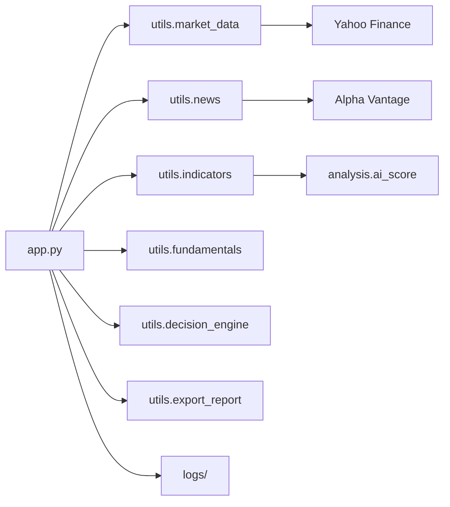

# StockShield AI

Professional-grade equity analysis terminal: technicals, fundamentals, news, risk, and exportable reports — from one CLI.

```
=============================================
        📈 STOCKSHIELD AI
=============================================
Enter Stock Symbol: AAPL
```

## Installation

```bash
git clone https://github.com/marvelthorteg20-gif/StockShield-AI.git
cd StockShield-AI
python3 -m venv .venv
source .venv/bin/activate
pip install -r requirements.txt
python app.py
```

Python 3.10+ is recommended. Yahoo Finance is used for prices and fundamentals; Alpha Vantage is used for news sentiment (see `config.NEWS_API_KEY`).

## Features

- SMA20 / EMA20, RSI, MACD, Bollinger Bands, ATR(14), ADX(14), volume
- News sentiment and fundamental score
- Candlestick patterns and a weighted AI score
- Smart stop / targets, decision engine, star-rated overlay
- Multi-timeframe alignment and institutional structure signals
- Pivot + Fibonacci + dynamic support/resistance
- Swing plan and 2% position sizing
- AI narrative summary
- PDF / CSV / JSON export
- Production cache, logging, benchmarks, and typed configuration

## Architecture



| Layer | Role |
| --- | --- |
| `config.py` | ATR/RSI/MACD windows, risk %, export folder, theme |
| `utils/market_data.py` | Validated, cached Yahoo `info` + history |
| `utils/indicators.py` | Technical snapshot (unchanged return tuple) |
| `analysis/` | Patterns, risk math, AI score weights |
| `utils/decision_engine.py` | Strong Buy … Strong Sell |
| `app.py` | CLI layout, spinner, colors, benchmark footer |

## Configuration

Edit `config.py`:

```python
ATR_LENGTH = 14
RSI_PERIOD = 14
MACD_FAST = 12
MACD_SLOW = 26
MACD_SIGNAL = 9
RISK_PERCENT = 2.0
EXPORT_FOLDER = "reports"
THEME = "color"   # or "classic"
```

## Screenshots

A representative session is checked in as text (live prices change):

```text
See docs/screenshots/cli-sample.txt
```

Full capture: [`docs/screenshots/cli-sample.txt`](docs/screenshots/cli-sample.txt).

## Roadmap

- Optional broker adapters (paper trading only)
- Watchlist / multi-ticker batch mode
- Dark-theme HTML report
- Plug-in news providers besides Alpha Vantage

## Contributing

Please read [CONTRIBUTING.md](CONTRIBUTING.md) and our [Code of Conduct](CODE_OF_CONDUCT.md).

## License

[MIT](LICENSE)
