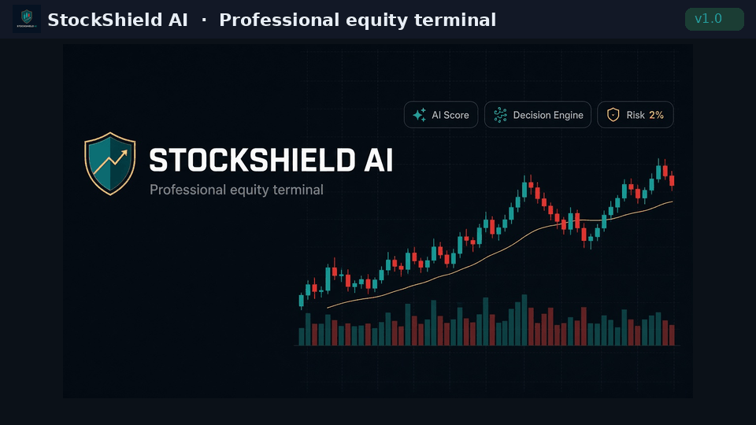
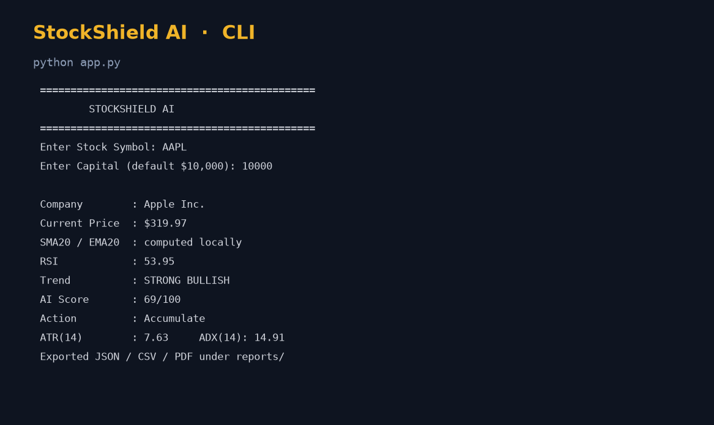
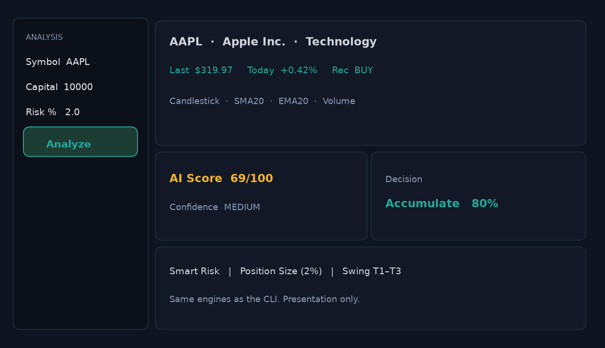
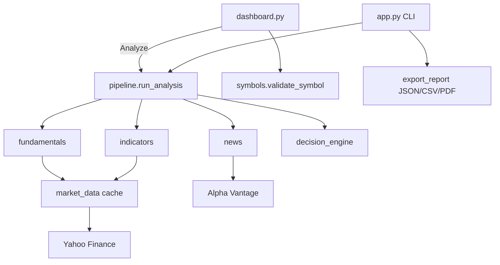

<p align="center">
  
</p>

<h1 align="center">StockShield AI</h1>

<p align="center">
  <strong>Professional equity terminal — CLI + dark dashboard — v1.0</strong>
</p>

<p align="center">
  
  
  
  
</p>

<p align="center">
  
</p>

StockShield scores a ticker from Yahoo Finance prices and Alpha Vantage news, then produces trend, oscillators, a weighted AI score, a Strong Buy → Strong Sell decision, smart stops, swing targets, 2% position sizing, multi-timeframe alignment, institutional flags, confluence S/R, and PDF / CSV / JSON export.

Use the **CLI** for a scripted terminal or the **Streamlit dashboard** for an interactive dark workspace. Both call the same `utils.pipeline.run_analysis()` engines.

This is not a broker, a signal subscription, or investment advice.

## Quick start

### Linux / macOS

```bash
git clone https://github.com/marvelthorteg20-gif/StockShield-AI.git
cd StockShield-AI
python3 -m venv .venv
source .venv/bin/activate
pip install -r requirements.txt
python app.py
```

### Windows

```bat
git clone https://github.com/marvelthorteg20-gif/StockShield-AI.git
cd StockShield-AI
py -3 -m venv .venv
.venv\Scripts\activate
pip install -r requirements.txt
python app.py
```

Dashboard (any OS):

```bash
streamlit run dashboard.py
```

(`streamlit_app.py` remains available.) Dark theme lives in `.streamlit/config.toml`.

Headless Linux / CI: `set MPLBACKEND=Agg` (Windows cmd: `set MPLBACKEND=Agg`).

## Demo



| CLI | Dashboard |
| --- | --- |
|  |  |

Sample exports: [`docs/sample-reports/`](docs/sample-reports/)  
CLI layout capture: [`docs/screenshots/cli-sample.txt`](docs/screenshots/cli-sample.txt)

## Features

- SMA20, EMA20, RSI, MACD, Bollinger Bands, ATR, ADX, volume
- Candlestick patterns (Hammer, Doji, Engulfing, Morning/Evening Star)
- Fundamentals and news sentiment
- AI score, decision engine, star rating
- Smart risk, swing plan, position sizing (default 2% risk)
- Multi-timeframe analysis and institutional signals
- Pivot / Fibonacci / dynamic support & resistance
- CLI terminal and Streamlit dark dashboard
- Cached Yahoo requests, JSONL + file logs, benchmark footer
- Graceful Yahoo `info` and news failures

v1.0 does **not** add indicators or change scoring rules. See [RELEASE_NOTES.md](RELEASE_NOTES.md).

## Architecture

```
app.py                 CLI (historical print layout)
dashboard.py           Fast-paint Streamlit terminal
streamlit_app.py       Alternate dashboard
utils/pipeline.py      Shared analysis orchestration
utils/indicators.py    Technical snapshot
utils/market_data.py   Cached Yahoo bundle
utils/symbols.py       Ticker validation (no yfinance)
analysis/              Score, patterns, risk math
config.py              Windows, risk %, export, theme, VERSION
```



Yahoo is fetched **once per symbol/period** inside `CACHE_TTL_SECONDS`. Fundamentals reuse that bundle.

## Tests

```bash
pytest
flake8
```

GitHub Actions runs the same commands on **Ubuntu and Windows**.

## Configuration

Tune windows in `config.py` (defaults preserve current math). Optional news key:

```bash
export ALPHA_VANTAGE_API_KEY=your_key
```

Windows: `set ALPHA_VANTAGE_API_KEY=your_key`

## License

MIT. See [LICENSE](LICENSE).

Please read [CONTRIBUTING.md](CONTRIBUTING.md), [SECURITY.md](SECURITY.md), and the [Code of Conduct](CODE_OF_CONDUCT.md).
