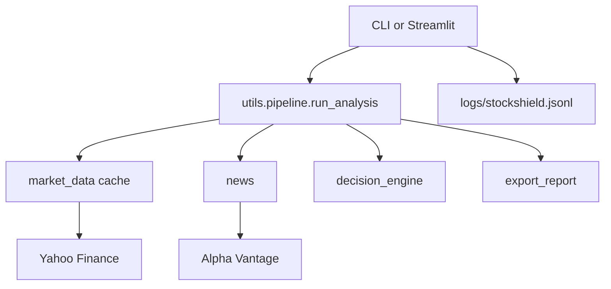

# StockShield AI

Professional equity analysis for operators who want a terminal, not a toy.

StockShield combines technicals, fundamentals, news, risk, and a decision engine into one Python package. Use the **CLI** for scripted runs or the **Streamlit dashboard** for an interactive dark workspace.

## Project Overview

StockShield AI scores a ticker from Yahoo Finance prices and Alpha Vantage news, then produces:

- Trend, oscillators, volatility, and volume
- A weighted AI score and a Strong Buy → Strong Sell decision
- Smart stops, swing targets, and 2% position sizing
- Multi-timeframe alignment, institutional structure flags, and confluence S/R
- PDF / CSV / JSON export plus a narrative summary

Nothing here is a broker, a signal subscription, or investment advice.

## Features

- SMA20, EMA20, RSI, MACD, Bollinger Bands, ATR, ADX, volume
- Candlestick patterns (Hammer, Doji, Engulfing, Morning/Evening Star)
- Fundamentals and news sentiment
- AI score, decision engine, star rating
- Smart risk, swing plan, position sizing
- Multi-timeframe analysis and institutional signals
- Pivot / Fibonacci / dynamic support & resistance
- CLI terminal and Streamlit dark dashboard
- Cached Yahoo requests, JSONL logs, benchmark footer

## Architecture

```
app.py                 CLI (exact historical print layout)
streamlit_app.py       Dark dashboard
utils/pipeline.py      Shared analysis orchestration
utils/indicators.py    Technical snapshot
utils/market_data.py   Cached Yahoo bundle
analysis/              Score, patterns, risk math
config.py              ATR / RSI / MACD / risk / export / theme
```



## Screenshots

> Placeholder — CLI


> Placeholder — Dashboard


Text capture of the CLI layout: [`docs/screenshots/cli-sample.txt`](docs/screenshots/cli-sample.txt)

## Installation

Python 3.10+ recommended.

```bash
git clone https://github.com/marvelthorteg20-gif/StockShield-AI.git
cd StockShield-AI
python3 -m venv .venv
source .venv/bin/activate
pip install -r requirements.txt
```

## Usage

CLI:

```bash
python app.py
```

You will be prompted for a symbol and capital. Reports land in `reports/`. Tune windows in `config.py`.

Dashboard:

```bash
streamlit run streamlit_app.py
```

Sidebar: symbol, capital, risk %, Analyze. Dark theme is set in `.streamlit/config.toml`.

Tests and lint (same as GitHub Actions):

```bash
pytest
flake8
```

## Future Roadmap

- Watchlist / multi-ticker batch from the dashboard
- Optional HTML report theme
- Swap-in news providers besides Alpha Vantage
- Paper-trading adapters (no live order routing in this repo)

## License

MIT. See [LICENSE](LICENSE).

Please read [CONTRIBUTING.md](CONTRIBUTING.md) and the [Code of Conduct](CODE_OF_CONDUCT.md).
